# battinenia1.github.io
Professional Profile Website for WAPH Project 1
# WAPH-Web Application Programming and Hacking
**Individual Project 1**
Front-end Web Development with a Professional Profile 
Website on Bitbucket.io Cloud service 
Course Number : CPS592 
Course Name : WAPH(Web Application Programming And Hacking) 
## Instructor/Professor : Dr. Phu Phung 
**Presented By**: Battineni Anvitha
**Email** : battinenia1@udayton.edu
Website url: https://battinenia1.github.io/

Repository url: https://github.com/battinenia1/battinenia1.github.io/blob/main/index.html
**Part I** : General Requirements
***Task I***:
Using my headshot, I made a professional website that included my resume, academic accomplishments, professional experiences, and personal information. Additionally, I have contributed my skill set and used Bitbucket.io Cloud to deploy the website.
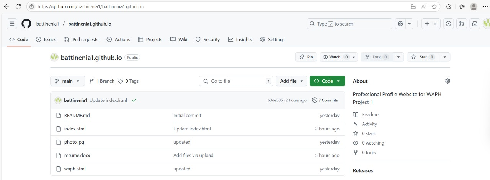
I made a second HTML file called waph and connected it to the Index.html file so that they are interconnected so that the resume can display my background.In order to inform visitors about the skill they are viewing, I have also included hyperlinks to the skills tab. Clicking on the skill will direct them to the skill's dedicated website or educational resource.
 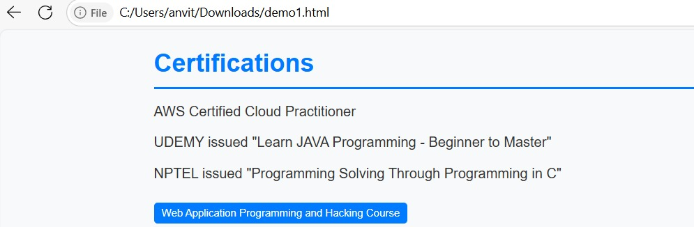
 I've also included links to the skills I've acquired over the years. They will be taken to either an educational website to learn more about the skill or a website where they can download it after clicking on it.I'm clicking on the HTML now, which will take me to the geeksforgeeks page about HTML.
 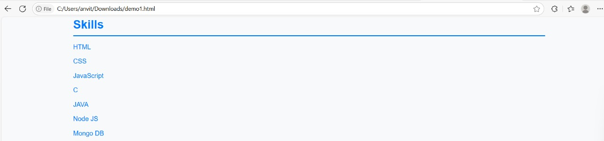
 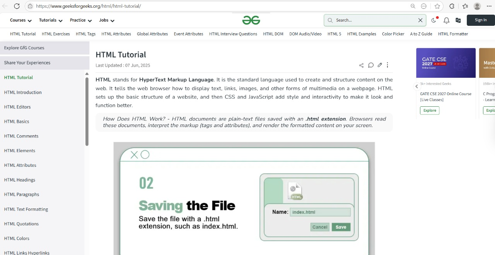

***Task II***: Provide a link to a fresh HTML page that introduces the course "Web Application Programming and Hacking" and its associated practical exercises. 
Additionally, I made another HTML page called Web-Application-Hacking.html and included the course information there. The webpage contains the following information: the instructor, the course results, tentative topics, and the goals and objectives of the course.I've also included links to the course page on Canvas, the instructor's email addresses, and the comprehensive class schedule.
Additionally, I have included a link to the course page at the bottom of the page. By clicking on the link, users and visitors can view comprehensive course information: https://bit.ly/waph-s25
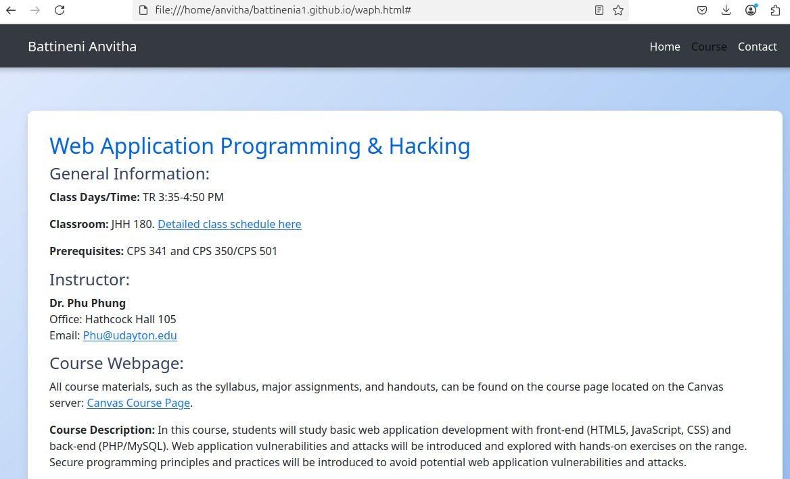

 **Non-Technical Requirements**
***Task I:***
For the HTML pages, I used the open-source CSS bootstrap template, which can be found at "https://stackpath.bootstrapcdn.com/bootstrap/4.5.2/css/bootstrap.min.css". 
I have included the bootstrap in the head tag before the body tag, which will help me get the respective bootstrap functionalities to design the website. Usually, this is inserted in the <head> block of the html code to gain all the bootstrap css frameworks in the webpage. Using this framework, the page can instantly get the necessary css styles, components to design interactive and responsive websites
Additionally, the flag counter features geographic tracking to display the nation from which the website was accessed.The image displays the flag counter that is incorporated into the index.html page.The flag counter indicates that index.html has been viewed 43 times, with 3 users from the USA and three from India.This code is utilized to incorporate the code into the website. Additionally, if ad-blockers are enabled on the website, the flag counter occasionally vanishes and performs poorly. 
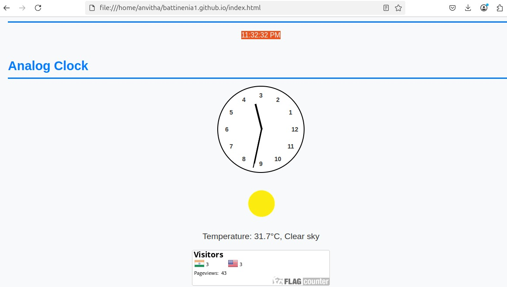

**Technical Requirements**
***Task-1 Basic Java Script Code***
JQuery and JavaScript will be used in this task to implement a number of features, including an analog and digital clock, the ability to show or hide your email, and a current date/time.Initially, we will use JavaScript to design both the digital and analog clocks.I used HTML and JavaScript code to design the digital and analog clocks.

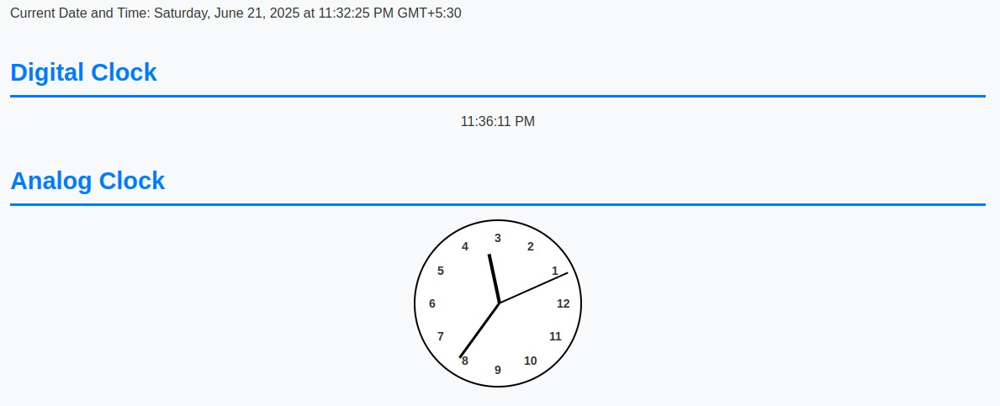

***Public Web API Integration ***
I have used a container with 
 tags and Java script to integrate the joke api, which delivers a new joke every minute, into my website through a link.Using the div tag from the HTML entity, I first made a container. That is displayed below.Additionally, I have included a disclaimer that we are not liable for the jokes or content that is generated.Using the fetch keyword, I have written the Java script code to retrieve the joke from the corresponding user interface.Additionally, I have established a time interval that calls for updates every minute.This is the code.This is how the joke api appears on the website and also disclaimer is included in the second joke picture.

Every minute, a new joke will be presented to us. The jokes in the last two images are different, indicating that they are updated every minute.
Public API to display weather-
Using JavaScript and the opennweather api key, the weather api integration was completed, displaying the local weather.To make it simple for users to view the data, I made a container to store the weather.I used the div class="container mt-5 fadeIn" id="weather" to create the container. After that, I wrote javascript code to retrieve the data from the Open Weather API key to ensure that the data was correct.
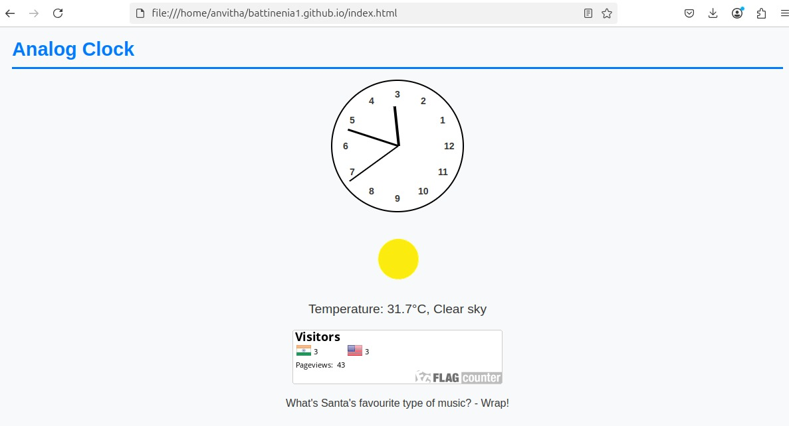
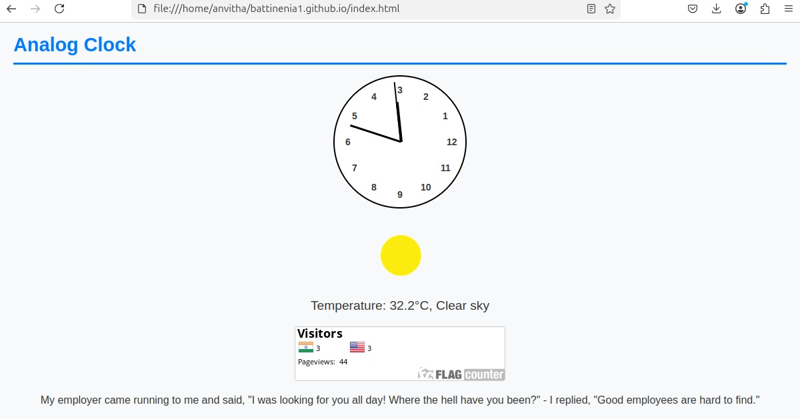

JavaScript cookies to keep the client in mind: 
I used a cookie alert in the CSS styling to display the user's first or last visit time as an alert at the top of the website. It uses cookies to remember the user's last visit or if it is the first visit. I wrote the cookie alert in HTML to display inside a div> tag like this: div class="cookie-alert" id="cookieAlert"div 
Below is the javascript code that makes the cookie function.
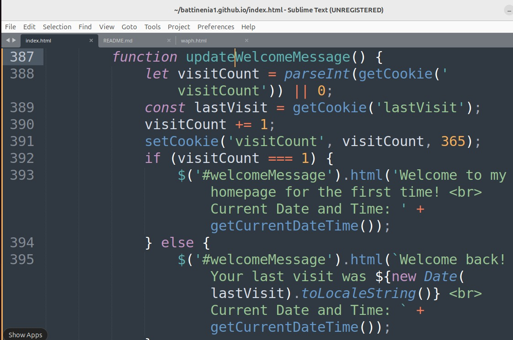
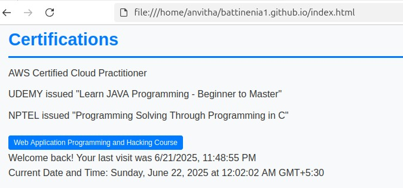